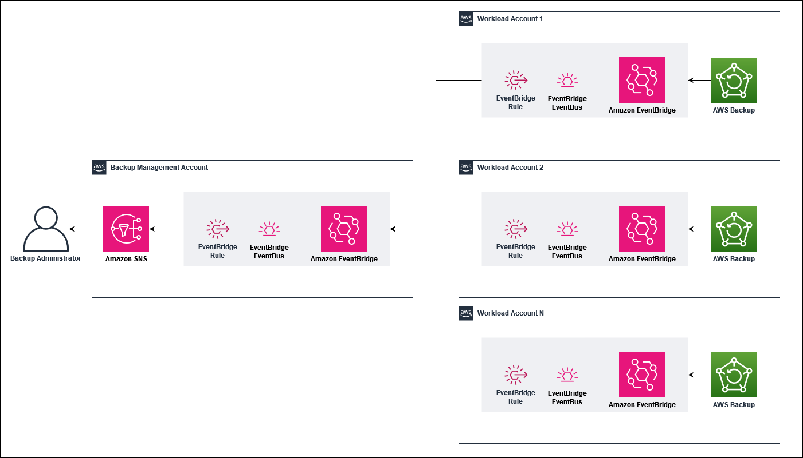

# Cross Account AWS Backup Notifications

This solution demonstrates how to centralize AWS Backup job event notifications from multiple AWS accounts into a single account. This can be useful when implementing automated responses to backup events or managing user notifications across accounts. This serves as a reference for how SNS and EventBridge can be used to forward and process AWS Backup events in a multi-account setup. As this serves as a reference it is not intended to be directly used in production environments without further review and alignment with organizational security policies.

## Prerequisites

- AWS Organizations enabled and access to the management account.
- [Enable AWS Backup cross-acccount managament](https://docs.aws.amazon.com/aws-backup/latest/devguide/manage-cross-account.html#enable-cross-account) (optional), if you choose to deploy AWS CloudFormation stack sets from an account other than the management account.
- An AWS account that will be used as your _backup management account_. 

## Solution Overview

This solution deploys a custom event bus, and rule in the _backup management account_ which will be used to receive and forward events to an Amazon SNS topic. The SNS topic is also created as part of the solution. For testing purposes, you can subscribe by email to the topic to receive events.

Within each _workload account_, the default event bus is used to capture and forward all AWS Backup events to the _backup management account_. By default, all events are forwarded by the EventBridge rule created in each workload account but this can be centrally adjusted to [target specific events](https://docs.aws.amazon.com/aws-backup/latest/devguide/eventbridge.html) such as job failures or deletions. 

## Getting started

### Backup management account

The _backup management account_ is the AWS account you wish to use to receive backup events from. Deploy the [Backup Management](./backup-management.yml) CloudFormation stack within that account and region.

1. From the AWS CloudFormation console, click "Create Stack", and in the drop down select "With new resources (Standard)".

2. In the Create stack wizard, upload the [Backup Management](./backup-management.yml) template and provide a stack name.

3. The stack takes three parameters, `EventBusName`, `OrgID` and `SNSTopicName`. `EventBusName` is the name of the custom Amazon EventBridge event bus created to receive backup events. The `OrgID` parameter is your AWS Organization ID that will be used to set the resource policy of the event bus to only receive events from AWS accounts within your organization. Lastly, the `SNSTopicName` is the name of the SNS topic created which will be the target of the EventBridge rule.

4. Acknowledge that the CloudFormation stack will create IAM resources, review and create the stack.

### Workload account

The _workload account_ can be one or more AWS accounts you wish to receive backup events from. The [Backup Member](./backup-member.yml) CloudFormation template can be deployed individually within these accounts. However, we recommend using [AWS CloudFormation StackSets](https://docs.aws.amazon.com/organizations/latest/userguide/services-that-can-integrate-cloudformation.html#integrate-enable-da-cloudformation) to manage deployment of resources across several accounts and regions within an AWS Organization. This feature of AWS Organizations can be used from the _management account_ or an account that is a delegated administrator.

This template takes three parameters, `BackupManagementAccountID`, `BackupRuleName` and `CentralEventBusName`. `BackupManagementAccountID` is the AWS account ID of the _backup management account_. The `BackupRuleName` parameter is the name of the EventBridge Rule that forwards Backup events to the _backup management account_, this can be left as default. Lastly, for the `CentralEventBusName` parameter pass in the name used to create the custom event bus in the _central backup account_.

#### Deploying as a CloudFormation Stack
If you choose to deploy the template within a single account as a CloudFormation Stack follow these steps.

1. From the AWS CloudFormation console of a _workload account_, click "Create Stack", and in the drop down select "With new resources (Standard)".

2. On the Create stack page, upload the [Backup Member](./backup-member.yml) template and provide a stack name.

3. Fill out the relevant details for each parameter, then review and create the stack.

#### Deploying as a CloudFormation StackSet
If you choose to deploy the template as a Cloudformation StackSet to one or more workload accounts follow these steps. The steps must be carried out from the Organization's management account or an account that has been delegated as an administrator, this account will be referred to as the _management account_ in the following steps.

1. From the AWS CloudFormation console of the Organization's _management account_, choose **StackSets**, and then **Create StackSets**. 

2. In the creation wizard, select **Service-managed permissions** if you have set this up, or enter the [**Permissions** that are self-managed](https://docs.aws.amazon.com/AWSCloudFormation/latest/UserGuide/stacksets-prereqs-self-managed.html).

3. Next, select **Template is ready** and upload the [Backup Member](./backup-member.yml) template.

4. Under **Specify StackSet details**, fill out the relevant details for each parameter.

5. Next, for the **Execution configuration**, choose **Active**, and on the **Set deployment options** page enter information for the target _workload accounts_. This could be in the form of an organization unit(s) or a list of account IDs. Next, specify the regions to deploy resources to. The default values can be reused for the remainder of the wizard.

5. **Review** and select **Create StackSet**.

## Clean up

### Backup management account

To remove resources within the _backup management account_ delete the previously created [CloudFormation stack](https://docs.aws.amazon.com/AWSCloudFormation/latest/UserGuide/cfn-console-delete-stack.html).

### Workload account

To remove resources created in _workloads accounts_ using CloudFormatinon Stacks, [delete the stacks](https://docs.aws.amazon.com/AWSCloudFormation/latest/UserGuide/cfn-console-delete-stack.html) directly from the accounts they were created from. For resources created through CloudFormation StackSets, instances of stacks within _workload accounts_ can be [deleted centrally from the _management account_](https://docs.aws.amazon.com/AWSCloudFormation/latest/UserGuide/stackinstances-delete.html). The CloudFormation StackSet resource can [also be deleted](https://docs.aws.amazon.com/AWSCloudFormation/latest/UserGuide/stacksets-delete.html).

## Security

See [CONTRIBUTING](CONTRIBUTING.md#security-issue-notifications) for more information.

## License

This library is licensed under the MIT-0 License. See the LICENSE file.
